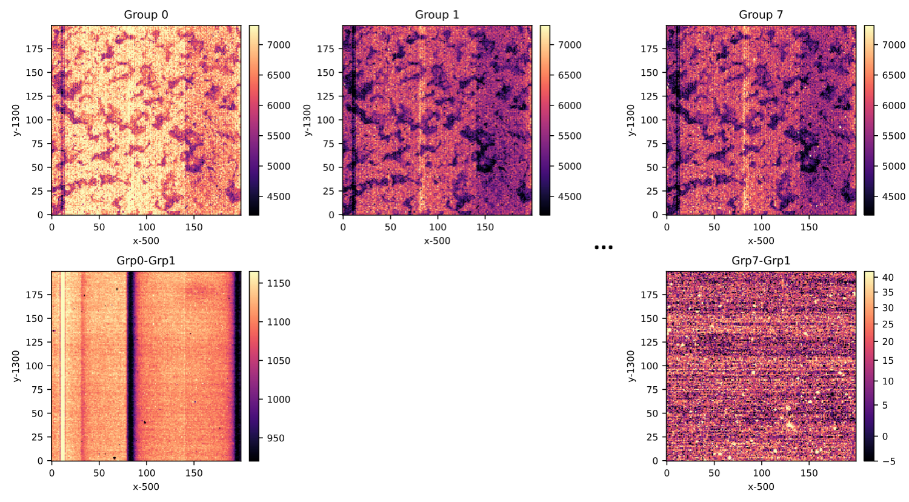

Utilities for romanimpreprocess
#########################################

These tools were mostly built for internal use or for checking the outputs. I have listed here some of the utilities that are likely to be of most interest for people adding to this package or deciding how they want to set parameters.

Utilities for working with simulation outputs
===================================================

Visualization
***************

The ``visualize`` script is useful for looking at cutouts of L1 images. Visual inspection of L1 images is often difficult since - aside from the brightest sources - the bias pattern overwhelms most of the interesting structure, and so it can be hard to tell if an L1 simulation did the "right" thing.

The script can be called as::

  # template -->
  # python visualize.py infile.asdf xmin,xmax,ymin,ymax outfile.pdf [percentile_cut]
  python visualize.py sim1.asdf 500,699,1300,1499 myprettyplot.pdf 2

This example will take the Level 1 image "sim1.asdf", extract the region from x=500..699 and y=1300..1499 (inclusive!), and write a filmstrip of the group averages to "myprettyplot.pdf". The top row shows the group averages, and the bottom row shows the differences. The percentile cut is used to set the scale; the default is 2 (i.e., set the scales from 2nd to 98th percentile). An example of such a filmstrip from an early Level 1 simulation is shown below (for size reasons, I clipped out only the beginning and the end):

Mask utilities
****************

The ``romanimpreprocess.utils.maskhandling.CombinedMask`` class allows one to build a boolean mask out of the bitmask. It can also grow different bits by a specified amount. A simple example would be::

    # ... above here, make dq a 2D numpy array with dtype=np.uint32
    myMaskFunc = romanimpreprocess.utils.maskhandling.CombinedMask(
                 {'jump_det': 5, 'gw_affected_data': 1})
    mymask = myMaskFunc.build(dq)

Now ``mymask`` is an array that is True if a pixel or its cardinal nearest neighbor (i.e., one of the 5 pixels closest to it) has ``JUMP_DET`` set, *or* if it has ``GW_AFFECTED_DATA`` set (in that 1 pixel). This flag names are not case-sensitive. Particularly useful instances of ``CombinedMask`` may be defined in ``maskhandling``.

The supported pixel counts now are 1 (flag only that pixel), 5 (flag Cartesian nearest neighbors), 9 (flag 3x3), and 25 (flag 5x5).

Utilities used internally
============================

IPC \& linearity utilities
****************************

The ``romanimpreprocess.utils.ipc_linearity`` module contains some useful tools for working with IPC convolution/deconvolution and Legendre polynomial-based linearity corrections.

IPC
------

A 2D image can be "convolved" or "de-convolved" with an IPC kernel via::

    image_convolved = ipc_fwd(image, kernel)
    image_orig = ipc_rev(image_convolved, kernel)

Here the kernel is allowed to be spatially varying, i.e., it has shape 3,3,ny,nx and the coupling from (x,y) to (x+dx,y+dy) is in kernel[dy,dx,y,x]. As defined here, the "kernel" acts in electrons. If you want it to act in DN instead, you can specify the ``gain`` keyword, ``ipc_fwd(image, kernel, gain=gain_array)``. The difference only matters when you have spatially varying gain.

The ipc_rev function allows one to specify the ``order`` keyword, which determines how far out the inverse IPC kernel is propagated; the default (recommended) value is 2, which corrects the alpha\^2 terms in the deconvolution, but only propagates information out to a 5x5 box.

Linearity
------------

The linearity (DN_raw --> DN_lin) and inverse linearity (DN_lin --> DN_raw) can be carried out as follows::

    S, exflag = invlinearity(Slin, linearity_file, origin=(0,0))
    S_relinearized, dq = linearity(S, linearity_file, origin=(0,0))

Here ``Slin`` is 2D array of linearized signal; ``S`` is transformed to raw data numbers; and ``S_relinearized`` is converted back to linearized signal. Here ``origin`` specifies the (x,y) in the linearity file that corresponds to (0,0) in the signal array. (This allows you to process subarrays; I've found it especially useful for processing only science pixels.) The ``linearity_file`` is taken to be in ASDF Legendre cube format, i.e., the ``['roman']['data']`` branch is a numpy array with shape (p_order+1, 4096, 4096).

The return flags are ``exflag`` (indicating extrapolating off the linearity curve: currently not actually used, but I did use it during some testing and may use it in the future), and ``dq`` (uint32 array, Roman bit indexing).

Combined IPC, linearity, and gain
--------------------------------------

The ``romanimpreprocess.utils.ipc_linearity.IL`` class is suitable for passing to another function. Its job is to convert an image in physical electrons in a well to observable DN. It can be built from ipc4d, linearitylegendre, and gain files::

    myILobj = romanimpreprocess.utils.ipc_linearity.IL(
                  linearity_file, gain_file, ipc_file, start_e=0.)

Here ``start_e`` is an optional offset (floating point number or array) that can be applied to the number of electrons in the well. This is useful if you want to make an object that also knows about the reset noise (and then applies that reset noise consistently as long as the object exists).

You can also set a data quality array in this object::

    myILobj.set_dq(ngroup=1, nborder=4)

so then ``myILobj.dq`` will be a 3D data quality array (in this case, set for 1 group), but this isn't directly used inside the IL class right now - it's just there as an attribute if someone needs it.

The main application of the IL class is to be able to pass it to another function that will call the ``apply`` method. The most common way to call this would be to run::

    S = myILobj.apply(Q, electrons=True, electrons_out=False) 

where ``Q`` is a numpy array of the collected charge (specified by the ``electrons`` keyword: True for electrons, False for DN_lin). The starting charge, IPC, gain, and inverse linearity curves are then applied. The output is in DN_raw if ``electrons_out`` is False (but you can convert to apparent electrons, i.e., with the gain factor, if ``electrons_out`` is True).
